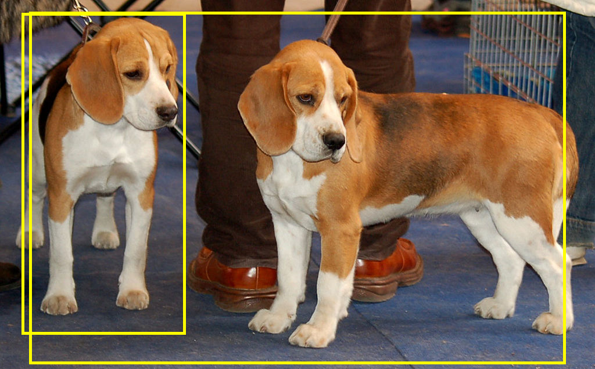

# Tensorflow Lite Object Detection with the Tensorflow Object Detection API

[](https://github.com/tensorflow/tensorflow/releases/tag/v2.3.0)



# Introduction

TensorFlow Lite(TFLite) is TensorFlow’s lightweight solution for mobile and embedded devices. It enables on-device machine learning inference with low latency and a small binary size. TensorFlow Lite uses many techniques for this such as quantized kernels that allow smaller and faster (fixed-point math) models.

This document walks you through converting a Tensorflow Object Detection API model to Tensorflow Lite.

> NOTE: TFLite currently only supports SSD Architectures (excluding EfficientDet) for boxes-based detection. Support for EfficientDet is coming soon.

# 1.Train a object detection model using the Tensorflow OD API

For this guide you can either use a pre-trained model from the [Tensorflow Model zoo](https://github.com/tensorflow/models/blob/master/research/object_detection/g3doc/tf2_detection_zoo.md) or you can train your own custom model as described in [one of my other Github repositories](https://github.com/TannerGilbert/Tensorflow-Object-Detection-API-Train-Model).

# 2.Convert the model to Tensorflow Lite

After you have a Tensorflow OD model you can start to convert it to Tensorflow Lite.

This is a two-step process:
1. Export frozen inference graph for TFLite
2. Convert to TFLite

## 2.1 Export frozen inference graph for TFLite

After training the model you need to export the model so that the graph architecture and network operations are compatible with Tensorflow Lite. This can be done with the ```export_tflite_graph_tf2.py``` file.

```bash
# From the tensorflow/models/research/ directory
python object_detection/export_tflite_graph_tf2.py \
    --pipeline_config_path path/to/ssd_model/pipeline.config \
    --trained_checkpoint_dir path/to/ssd_model/checkpoint \
    --output_directory path/to/exported_model_directory
```

In the ```output_directory``` you should now see a saved_model folder.

## 2.2. Convert to TFLite

Use the [TensorFlow Lite Converter](https://www.tensorflow.org/lite/convert) to convert the SavedModel to TFLite. Note that you need to use from_saved_model for TFLite conversion with the Python API.

Python API (recommended):

```python
# Convert the model to TF lite
converter = tf.lite.TFLiteConverter.from_saved_model('/content/saved_model/')
converter.optimizations = [tf.lite.Optimize.DEFAULT]
tflite_model = converter.convert()

# Serialize the model
open('model.tflite', 'wb').write(tflite_model)
```

Command line:

```bash
tflite_convert \
  --saved_model_dir=<output_directory>/saved_model \
  --output_file=model.tflite
```

You can also leverage [Post-training Quantization](https://www.tensorflow.org/lite/performance/post_training_quantization) to [optimize the performance](https://www.tensorflow.org/lite/performance/model_optimization) and decrease the size of your model. Note that this is only possible from the Python API.

```python
converter.optimizations = [tf.lite.Optimize.DEFAULT]
converter.target_spec.supported_ops = [tf.lite.OpsSet.TFLITE_BUILTINS_INT8,
                                       tf.lite.OpsSet.TFLITE_BUILTINS]
converter.representative_dataset = <...>
```

> Be sure to use a [representative dataset](https://www.tensorflow.org/lite/performance/post_training_quantization#full_integer_quantization)

## 2.3 Create new labelmap for Tensorflow Lite

Next you need to create a label map for Tensorflow Lite, since it doesn't have the same format as a classical Tensorflow labelmap.

Tensorflow labelmap:

```bash
item {
    name: "a"
    id: 1
    display_name: "a"
}
item {
    name: "b"
    id: 2
    display_name: "b"
}
item {
    name: "c"
    id: 3
    display_name: "c"
}
```

The Tensorflow Lite labelmap format only has the display_names (if there is no display_name the name is used).

```bash
a
b
c
``` 

So basically the only thing you need to do is to create a new labelmap file and copy the display_names (names) from the other labelmap file into it.

### 2.4 Optional: Convert Tensorflow Lite model to use with the Google Coral EdgeTPU

If you want to use the model with a Google Coral EdgeTPU you need to run it through the EdgeTPU Compiler. 

The compiler can be installed on Linux systems (Debian 6.0 or higher) with the following commands:

```bash
curl https://packages.cloud.google.com/apt/doc/apt-key.gpg | sudo apt-key add -

echo "deb https://packages.cloud.google.com/apt coral-edgetpu-stable main" | sudo tee /etc/apt/sources.list.d/coral-edgetpu.list

sudo apt-get update

sudo apt-get install edgetpu
```

After installing the compiler you can convert the model with the following command:

```edgetpu_compiler [options] model...```

Before using the compiler, be sure you have a model that's compatible with the Edge TPU. For compatibility details, read [TensorFlow models on the Edge TPU](https://coral.ai/docs/edgetpu/models-intro/).

## 3. Using the model for inference

This repository contains two scripts to run the model. On for running the object detection model on a video and one for running it on a webcam. Both can be run with or without the EdgeTPU.

* [Object Detection on video](tflite_object_detection_with_video.py)
* [Object Detection on webcam](tflite_object_detection_with_webcam.py)

## Author
 **Gilbert Tanner**
 
## Support me

<a href="https://www.buymeacoffee.com/gilberttanner" target="_blank"></a>