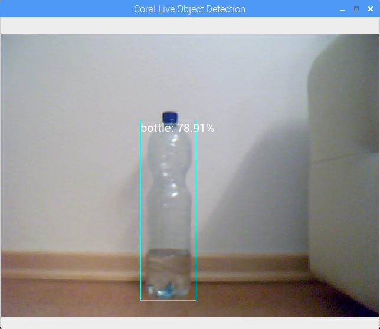

# Tensorflow Lite Object Detection with the Tensorflow Object Detection API




# 1.Train a object detection model using the Tensorflow Object Detection API


The first step of creating a object detector that works with Tensorflow Lite is to train a object detector. For a complete step by step guide on how to train your own custom object detector check out [my article](https://gilberttanner.com/blog/creating-your-own-objectdetector).

# 2.Convert the model to Tensorflow Lite

After you have a Tensorflow Object Detection model you can start to convert it to Tensorflow Lite.

This is a three-step process:
1. Export frozen inference graph for TFLite
2. Build Tensorflow from source (needed for the third step)
3. Using TOCO to create a optimized TensorFlow Lite Model

## 2.1 Export frozen inference graph for TFLite

After training the model you need to export the model so that the graph architecture and network operations are compatible with Tensorflow Lite. This can be done with the ```export_tflite_ssd_graph.py``` file.

```bash
mkdir inference_graph

python export_inference_graph.py --pipeline_config_path training/faster_rcnn_inception_v2_pets.config --trained_checkpoint_prefix training/model.ckpt-XXXX --output_directory inference_graph --add_postprocessing_op=true
```
XXXX represents the highest number.

## 2.2 Build Tensorflow from source

Now, you need to convert the actual model into an optimized FlatBuffer format that runs efficiently on Tensorflow Lite. This can be done with the Tensorflow Lite Optimizing Converter (TOCO).

For this, to work you need to have Tensorflow installed from scratch. This is a tedious task which I wouldn't cover in this tutorial. But you can follow the official installation guide. I'd recommend you to create an Anaconda Environment specifically for this purpose.

After building Tensorflow from scratch you're ready to start the with the conversation.

## 2.3. Using TOCO to Create Optimzed TensorFlow Lite Model

To convert the frozen graph to Tensorflow Lite we need to run it through the Tensorflow Lite Optimizing Converter (TOCO). TOCO converts the model into an optimized FlatBuffer format that runs efficiently on Tensorflow Lite.

For this to work you need to have Tensorflow installed from scratch. This is a tedious task which I wouldn't cover in this tutorial. But you can follow the [official installation guide](https://www.tensorflow.org/install/source_windows). I'd recommend you to create a [Anaconda Environment](https://docs.conda.io/projects/conda/en/latest/user-guide/tasks/manage-environments.html) specificly for this purpose.

After building Tensorflow from scratch you're ready to start the with the conversation.

### 2.3.1 Create Tensorflow Lite model

To create a optimized Tensorflow Lite model we need to run TOCO. TOCO is locate in the tensorflow/lite directory, which you should have after install Tensorflow from source.

If you want to convert a quantized model you can run the following command:

```bash
export OUTPUT_DIR=/tmp/tflite
bazel run --config=opt tensorflow/lite/toco:toco -- \
--input_file=$OUTPUT_DIR/tflite_graph.pb \
--output_file=$OUTPUT_DIR/detect.tflite \
--input_shapes=1,300,300,3 \
--input_arrays=normalized_input_image_tensor \
--output_arrays='TFLite_Detection_PostProcess','TFLite_Detection_PostProcess:1','TFLite_Detection_PostProcess:2','TFLite_Detection_PostProcess:3' \
--inference_type=QUANTIZED_UINT8 \
--mean_values=128 \
--std_values=128 \
--change_concat_input_ranges=false \
--allow_custom_ops
```

If you are using a floating point model like a faster rcnn you'll need to change to command a bit:

```bash
export OUTPUT_DIR=/tmp/tflite
bazel run --config=opt tensorflow/lite/toco:toco -- \
--input_file=$OUTPUT_DIR/tflite_graph.pb \
--output_file=$OUTPUT_DIR/detect.tflite \
--input_shapes=1,300,300,3 \
--input_arrays=normalized_input_image_tensor \
--output_arrays='TFLite_Detection_PostProcess','TFLite_Detection_PostProcess:1','TFLite_Detection_PostProcess:2','TFLite_Detection_PostProcess:3' \
--inference_type=FLOAT  \
--allow_custom_ops
```

If you are working on Windows you might need to remove the ' if the command doesn't work. For more information on how to use TOCO check out [the official instructions](https://github.com/tensorflow/models/blob/master/research/object_detection/g3doc/running_on_mobile_tensorflowlite.md).

### 2.3.2 Create new labelmap for Tensorflow Lite

Next you need to create a label map for Tensorflow Lite, since it doesn't have the same format as a classical Tensorflow labelmap.

Tensorflow labelmap:

```bash
item {
    name: "a"
    id: 1
    display_name: "a"
}
item {
    name: "b"
    id: 2
    display_name: "b"
}
item {
    name: "c"
    id: 3
    display_name: "c"
}
```

The Tensorflow Lite labelmap format only has the display_names (if there is no display_name the name is used).

```bash
a
b
c
``` 

So basically the only thing you need to do is to create a new labelmap file and copy the display_names (names) from the other labelmap file into it.

### 2.3.3 Optional: Convert Tensorflow Lite model to use with the Google Coral EdgeTPU

If you want to use the model with a Google Coral EdgeTPU you need to run it through the EdgeTPU Compiler. 

The compiler can be installed on Linux systems (Debian 6.0 or higher) with the following commands:

```bash
curl https://packages.cloud.google.com/apt/doc/apt-key.gpg | sudo apt-key add -

echo "deb https://packages.cloud.google.com/apt coral-edgetpu-stable main" | sudo tee /etc/apt/sources.list.d/coral-edgetpu.list

sudo apt-get update

sudo apt-get install edgetpu
```

After installing the compiler you can convert the model with the following command:

```edgetpu_compiler [options] model...```

Before using the compiler, be sure you have a model that's compatible with the Edge TPU. For compatibility details, read [TensorFlow models on the Edge TPU](https://coral.ai/docs/edgetpu/models-intro/).

## 3. Using the model for inference

This repository contains two scripts to run the model. On for running the object detection model on a video and one for running it on a webcam. Both can be run with or without the EdgeTPU.

* [Object Detection on video](tflite_object_detection_with_video.py)
* [Object Detection on webcam](tflite_object_detection_with_webcam.py)

## Author
 **Gilbert Tanner**
 
## Support me

<a href="https://www.buymeacoffee.com/gilberttanner" target="_blank"></a>